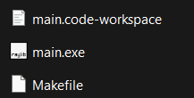

# Tetris game in C++

Tetris game in C++ language

# How I made this game

I made this game with tutorial from youtube, especially from here : [YT](https://www.youtube.com/watch?v=wVYKG_ch4yM&t=5175s)

# How to run the game

Just run the .exe file that i already build in the main directory.

  

 
 
 

# Video Tutorial

🎥 <a href="https://www.youtube.com/watch?v=wVYKG_ch4yM&t=5175s">Video Tutorial on YouTube</a>

